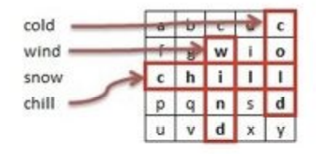

[](https://github.com/luke92/word-finder-net/actions/workflows/dotnet.yml)

# word-finder-net
Word Finder develop in NET

Objective: The objective of this challenge is not necessarily just to solve the problem but to evaluate your software development skills, code quality, analysis, creativity, and resourcefulness as a potential future colleague. Please share the necessary artifacts you would provide to your colleagues in a real-world professional setting to best evaluate your work.

Presented with a character matrix and a large stream of words, your task is to create a Class that searches the matrix to look for the words from the word stream. Words may appear horizontally, from left to right, or vertically, from top to bottom. In the example below, the word
stream has four words and the matrix contains only three of those words ("chill", "cold" and "wind"):



The search code must be implemented as a class with the following interface:
```
public class WordFinder
{
    public WordFinder(IEnumerable<string> matrix) {
        //...
    }
    public IEnumerable<string> Find(IEnumerable<string> wordstream)
    { 
        //...
    }
}
```

The WordFinder constructor receives a set of strings which represents a character matrix. The matrix size does not exceed 64x64, all strings contain the same number of characters. The "Find" method should return the top 10 most repeated words from the word stream found in the matrix. If no words are found, the "Find" method should return an empty set of strings. If any word in the word stream is found more than once within the stream, the search results should count it only once

Due to the size of the word stream, the code should be implemented in a high performance fashion both in terms of efficient algorithm and utilization of system resources. Where possible, please include your analysis and evaluation.

# Requisites
- Git
- Net 7

# Run program
```
git clone https://github.com/luke92/word-finder-net.git
cd word-finder-net
dotnet build
dotnet run --project WordFinderApp.ConsoleApp
```

# Run Tests
```
dotnet test
```

# Implementation Considerations
- The program is designed to have no more than 64 rows and/or more than 64 columns (If any of them are exceeded, an exception is thrown)
- It supports the possibility that the matrix is ​​not square, that is, that the number of rows is different from the number of columns
- It saves in memory the rows and columns of the provided matrix, so that the `Find()` method can be used more than once if necessary, allowing the second time that `Find()` is executed to take less time to process the results
- As the rows of the matrix are traversed, the matches are searched for and the columns are created, to avoid traversing the lists more than once
- The technical decisions taken are based on the fact that when using IEnumerable we are not sure, for example, that the Count() method has O(1) or O(n) complexity
- The same occurs with the construction of rows and columns, the technical decision is based on whether it is decided to remove the 64x64 size limitation and we had to process A 10000x10000 matrix has a smaller number of operations when building rows and columns at a time.